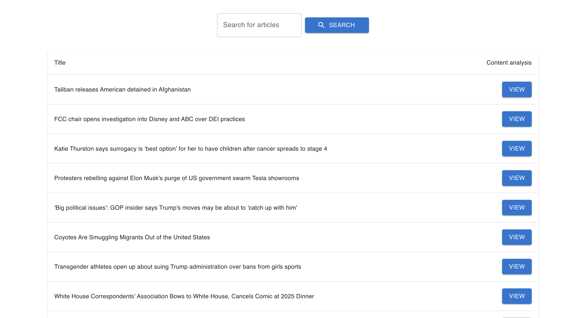
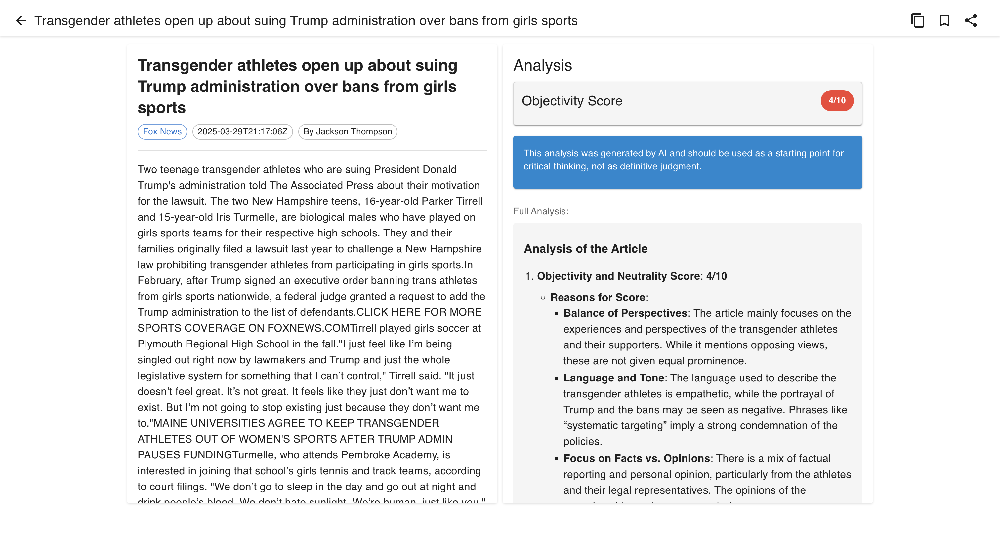

# News with AI

A full-stack news aggregation application that combines news search with AI-powered analysis to help readers identify bias and assess objectivity in news articles.

## 📱 App In Action

### Search and Results View

*The home page showing search functionality and news article results*

### Article Analysis View

*Detailed view of an article with AI-powered analysis showing objectivity score and bias detection*

## 🌟 Features

- **News Search**: Find articles by keyword using the News API
- **Content Parsing**: Extract clean article content from original sources
- **AI Analysis**: Analyze articles using OpenAI to assess:
  - Objectivity and neutrality score (0-10 scale)
  - Political and ideological bias detection
  - Article summary and assessment
- **Responsive UI**: Works seamlessly on desktop and mobile devices
- **Background Processing**: Asynchronous analysis with job queue for scalability
- **Caching**: Redis caching for improved performance and reduced API usage

## 🏗️ Architecture

The application consists of two main components:

### Frontend (React)

- React 18 application with Material UI
- Responsive design with mobile and desktop layouts
- Article view and analysis display components

### Backend (Node.js/Express)

- RESTful API endpoints for search, parsing, and analysis
- Redis for caching and distributed rate limiting
- Bull queue for background processing of analysis tasks
- OpenAI integration for content analysis
- Rate limiting for API protection
- Health check endpoints for monitoring

## 🛠️ Tech Stack

### Frontend
- React 18
- Material UI
- Axios for API requests
- React Markdown for rendering analysis

### Backend
- Node.js
- Express
- Bull for job queue
- Redis for caching and rate limiting
- Winston for logging
- OpenAI API (using gpt-4o-mini model)
- Postlight Parser for article extraction

## 🚀 Getting Started

### Prerequisites

- Node.js 16+
- Redis server
- News API key
- OpenAI API key

### Environment Setup

Create a `.env` file in the project root with the following variables:

```
# Server
PORT=3000
NODE_ENV=development

# CORS
CORS_ORIGIN=http://localhost:8080

# Redis
REDIS_URL=redis://localhost:6379

# API Keys
NEWS_API_KEY=your_news_api_key_here
OPENAI_API_KEY=your_openai_api_key_here
OPENAI_ORG_ID=your_openai_org_id_here  # Optional

# Rate Limiting
RATE_LIMIT_MAX=100

# React
REACT_APP_URL=http://localhost:3000
```

### Installation

1. Clone the repository
```bash
git clone https://github.com/yourusername/news-with-ai.git
cd news-with-ai
```

2. Install dependencies
```bash
npm install
```

3. Start development servers
```bash
# Start both backend and frontend in development mode
npm run dev

# Or start them separately
npm run dev:back  # Start backend only
npm run dev:front # Start frontend only
```

4. For production
```bash
# Build the React frontend
npm run build

# Start the production server
npm start
```

## 📊 API Endpoints

### Search Articles
- **POST** `/api/search`
- Searches for news articles based on a query
- Rate limited to 10 requests per 5 minutes
- Body: `{ "query": "your search term" }`

### Parse Article
- **GET** `/api/parse?url={article_url}`
- Extracts clean content from a news article URL

### Start Analysis
- **POST** `/api/start-analysis`
- Begins AI analysis of an article
- Rate limited to 5 requests per 10 minutes
- Returns a task ID for status checking
- Body: `{ "content": "article content to analyze" }`

### Check Analysis Status
- **GET** `/api/check-analysis/{taskId}`
- Checks the status of an analysis task
- Returns status and results when complete

### Health Check
- **GET** `/health`
- Basic health check
- **GET** `/health/detailed`
- Detailed health check with system information

## 🛡️ Rate Limiting

The application includes several tiers of rate limiting:

- Basic protection: 200 requests per minute (all routes)
- API rate limit: 100 requests per 15 minutes (configurable)
- Search: 10 requests per 5 minutes
- Analysis: 5 requests per 10 minutes

## 🔒 Security Features

- Helmet.js for secure HTTP headers
- CORS protection
- Rate limiting to prevent abuse
- Request size limiting
- Error handling that doesn't expose sensitive information in production

## 📋 Development

### Testing
```bash
npm test
```

### Linting
```bash
npm run lint
```

### Folder Structure

```
/
├── build/               # Production build folder
├── logs/                # Log files (in production)
├── public/              # Static public assets
├── server/              # Backend code
│   ├── config/          # Configuration files
│   ├── middleware/      # Express middleware
│   ├── queue/           # Bull job queue setup
│   ├── routes/          # API routes
│   ├── services/        # Service layer (OpenAI, News API, etc.)
│   └── utils/           # Utility functions
└── src/                 # Frontend React code
    ├── components/      # React components
    └── App.js           # Main React application
```

## 📝 License

This project is licensed under the MIT License - see the LICENSE file for details.

## 🙏 Acknowledgments

- [News API](https://newsapi.org/) for providing news data
- [Postlight Parser](https://github.com/postlight/parser) for article extraction
- [OpenAI](https://openai.com/) for AI analysis capabilities